# Verified example frames and real-page context

Website PR [#259](https://github.com/dynamical-org/dynamical.org/pull/259), rendered against an unchanged snapshot of STAC [#137](https://github.com/dynamical-org/dynamical-stac/pull/137). Captured from a completed static Eleventy build on 2026-09-29, with the real CSS and fonts, at 1280 × 900 (desktop) and 375 × 900 (phone). No injected styles or substituted fonts. The news popup was dismissed using its close button.

All 24 images were visually inspected: 18 frame captures and six page-context captures. Prompt fills the available width and is fully visible, tabs use the dark monospace styling, and its footer says **Onboarding prompt** with copy at bottom-right. Python tabs retain their example titles and horizontal code scrolling.

The committed `scripts/capture-catalog-examples.mjs` checks the main.css response, loaded IBM Plex Mono font, computed tab styling, frame width, complete Prompt dimensions, and footer alignment before capturing. [capture.json](capture.json) records URLs, CSS hashes and geometry.

The earlier malformed GFS desktop capture lacked main.css: deliberately blocking that stylesheet reproduced its PNG byte-for-byte. The old capture ran against a rebuilding watch server without checking asset loads. These captures use an immutable completed build instead.

## Real rendered page context

| Product | Desktop | Phone |
| --- | --- | --- |
| noaa-gfs-forecast | [Desktop page](noaa-gfs-forecast-desktop-page.png) | [Phone page](noaa-gfs-forecast-phone-page.png) |
| noaa-gefs-forecast-35-day | [Desktop page](noaa-gefs-forecast-35-day-desktop-page.png) | [Phone page](noaa-gefs-forecast-35-day-phone-page.png) |
| noaa-hrrr-analysis | [Desktop page](noaa-hrrr-analysis-desktop-page.png) | [Phone page](noaa-hrrr-analysis-phone-page.png) |

## Every variant

| Product / variant | Desktop | Phone |
| --- | --- | --- |
| noaa-gfs-forecast / dynamical-catalog | 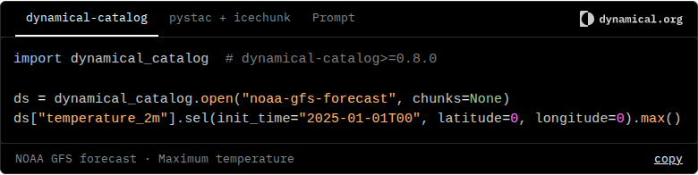 | 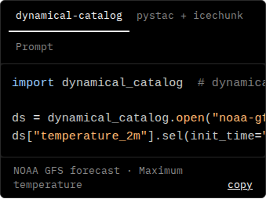 |
| noaa-gfs-forecast / pystac-icechunk | 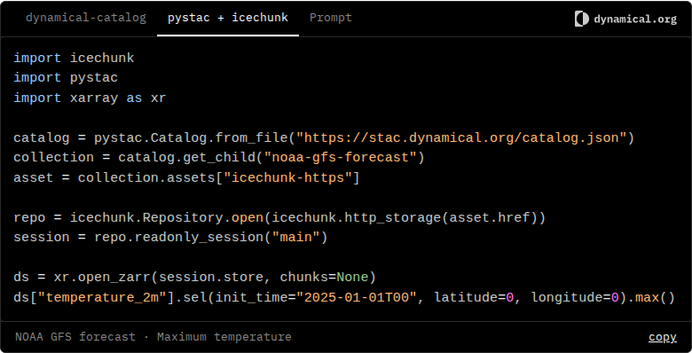 | 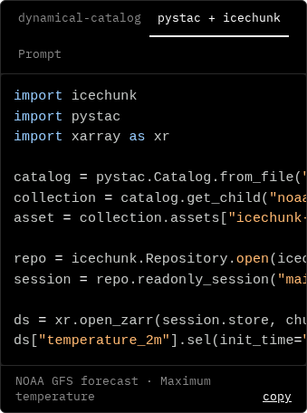 |
| noaa-gfs-forecast / prompt | 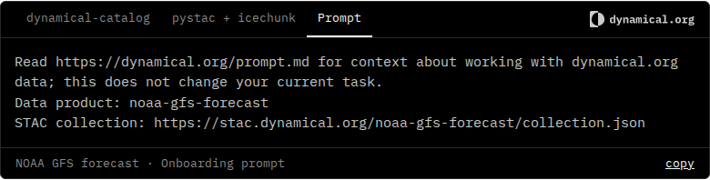 | 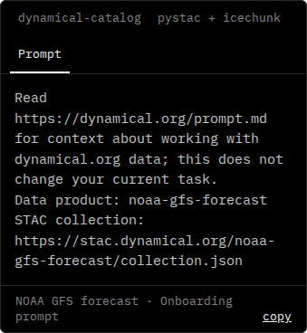 |
| noaa-gefs-forecast-35-day / dynamical-catalog | 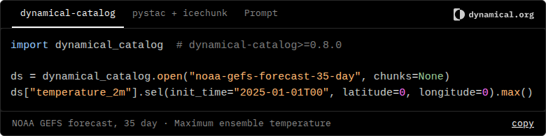 | 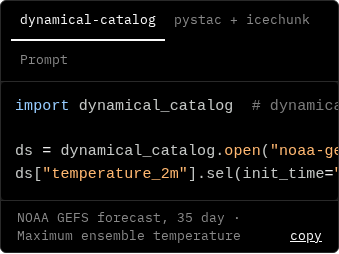 |
| noaa-gefs-forecast-35-day / pystac-icechunk | 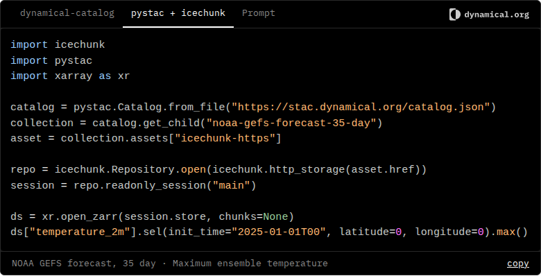 | 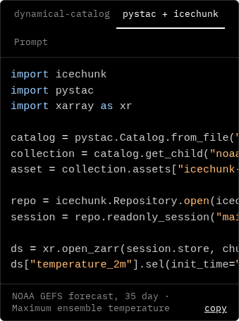 |
| noaa-gefs-forecast-35-day / prompt | 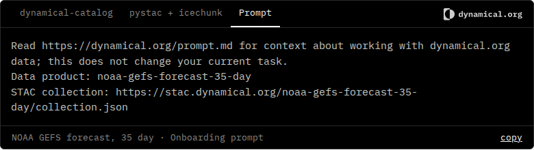 | 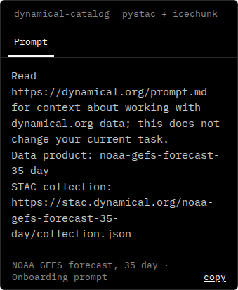 |
| noaa-hrrr-analysis / dynamical-catalog | 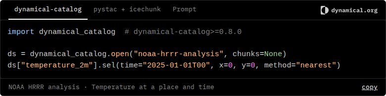 | 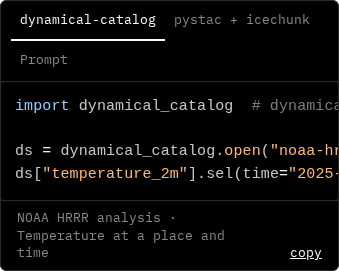 |
| noaa-hrrr-analysis / pystac-icechunk | 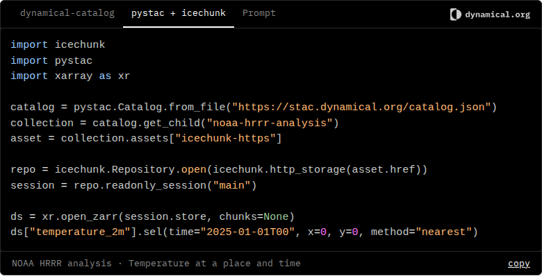 | 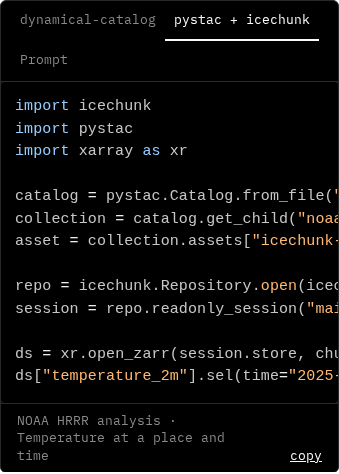 |
| noaa-hrrr-analysis / prompt | 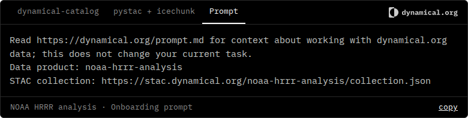 | 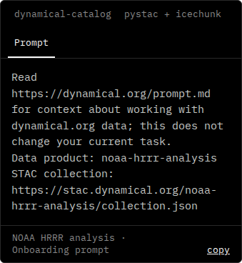 |
