# Generic Start and Example prompt views

Rendered locally from the website `stac-example-views` branch against the regenerated STAC #136 catalog. No production or staging STAC upload. The news popup was dismissed through its close button. Screenshots show the actual example frame at 1280px and 375px viewport widths.

| Product / viewport | Start | Example |
|---|---|---|
| GFS forecast / desktop | 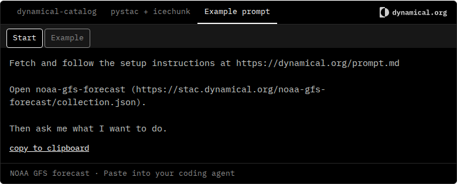 | 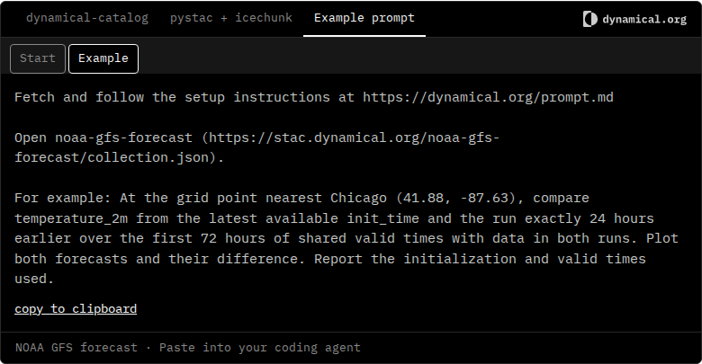 |
| GFS forecast / phone | 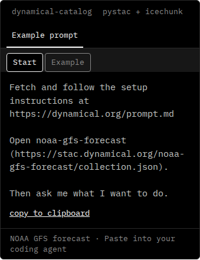 | 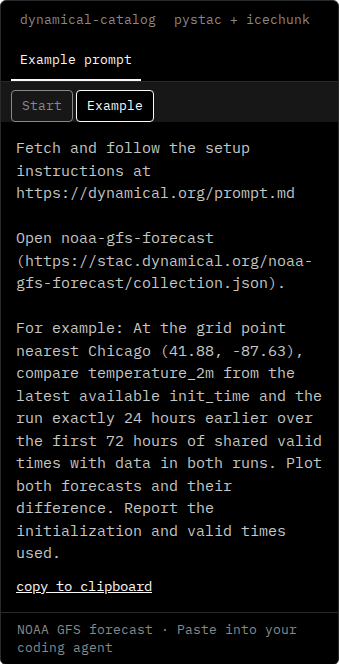 |
| GEFS 35-day / desktop | 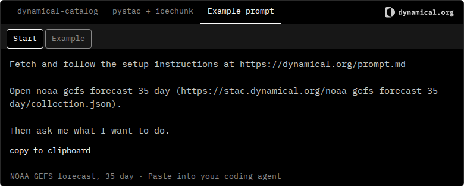 | 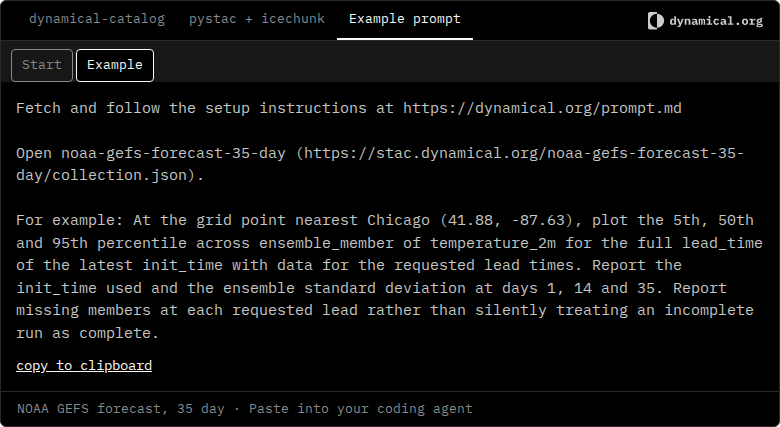 |
| GEFS 35-day / phone | 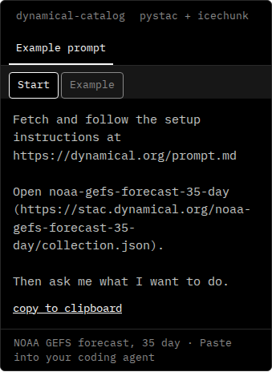 | 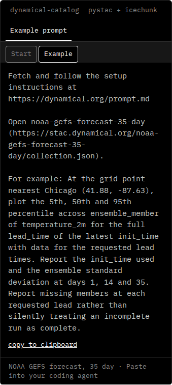 |
| HRRR analysis / desktop | 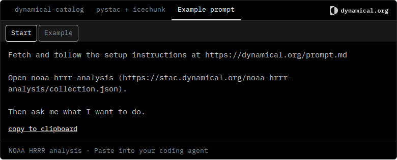 | 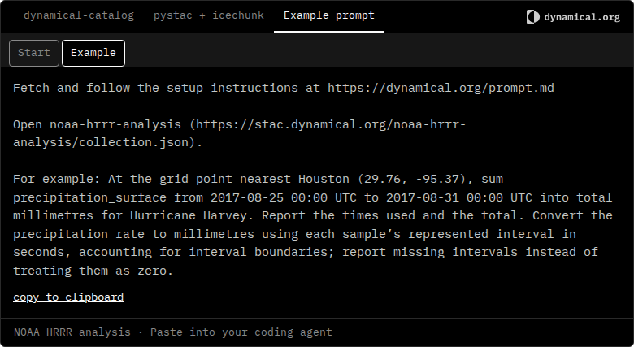 |
| HRRR analysis / phone | 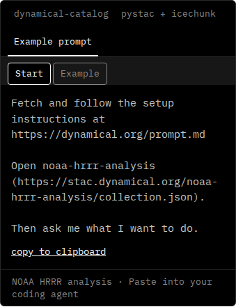 | 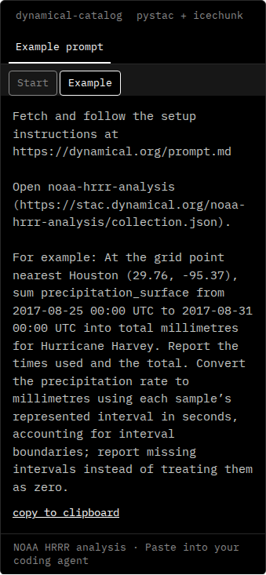 |
